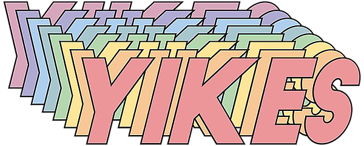
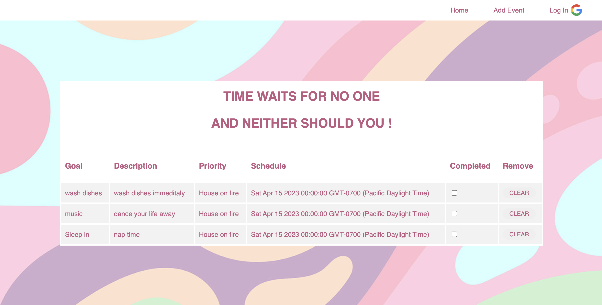

<h2>Project 2: Full-Stack Development</h2>
<h2>Original Idea</h2>
An application called RSVP where people could find events in their local area and connect with other confirmed RSVPs. To bring people back together after a pandemic.

<h2>Pivot:</h2>

 
AHH OUH! In the time frame I was allocated with I wasnt able to do my idea in the way that I wanted and chose to go a different route to make sure there was a product that could be viewed.

<b>IN 24 HRS<b>
<ul>
<li>Complete CSS turn-around</li>
<li>Properly implement CRUD</li>
<li>Oauth:User log-in compability</li>

<h2> New Idea </h2>
"Nizer" is your gateway to perfect organization, in its first phase youll be able to add a goal or plan out your day to get you on the right <b>path</b> (pun intended). 

The name is a simple break down of what you're looking to do which is organize! 

The app uses Google API to allow all users to log in and have access to the goals they are wanting to check off! After creating the event the user can also update, check completed or delete the goal if they no longer need to see it

<h2>Where it stared:</h2>

  

  
<h2>Technologies Used:</h2>
<ul>
<li>CSS</li>
<li>Express</li>
<li>JavaScript</li>
<li>Google OAuth 2.0</li>
<li>Heroku</li>
<li>MongoDB / mongoose</li>
<li>Node.js</li>
<li>Passport</li>
</ul>
<h2>Take A Look!</h2>
https://sei-project-rsvp.herokuapp.com

<h2>Next Steps</h2>
<ul>
<li> Enhance UI for proper user flow</li>
<li> Add functionality for editing, saving and to view 1 goal on a larger scale</li>
<li>Drag and grop feature</li>
<li>logo</logo>
<li>footer</li>

<h2>Take A Look!</h2>
https://sei-project-rsvp.herokuapp.com