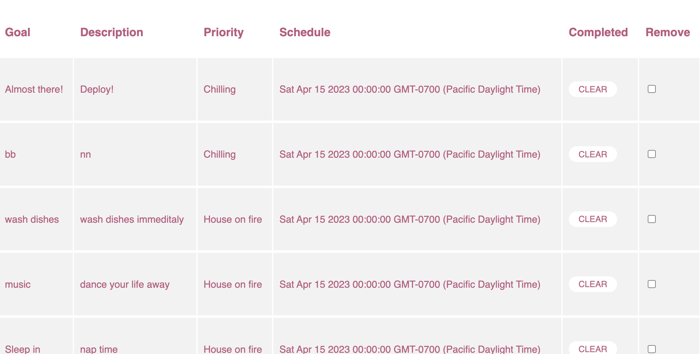

<h2>Project 2: Full-Stack Development</h2>

Nizer is your gateway to perfect organization, in its first phase youll be able to add a goal or plan out your day to get you on the right <b>path</b> (pun intended). 

The name is a siple break down of what youre looking to do which is organize! 

The app uses Google API to allow all users to log in and have access to the goals they are wanting to check off! After creating the event the user can also update, check completed or delete the goal if they no longer need to see it

<h2>Where it stared:</h2>
;

<h2>Technologies Used:</h2>
<ul>
<li>CSS</li>
<li>Express</li>
<li>JavaScript</li>
<li>Google OAuth 2.0</li>
<li>Heroku</li>
<li>MongoDB / mongoose</li>
<li>Node.js</li>
<li>Passport</li>
</ul>

<h2>Next Steps</h2>
<ul>
<li> Enhance UI for proper user flow</li>
<li> Add functionality for editing, saving and to view 1 goal on a larger scale</li>
<li>Drag and grop feature</li>
